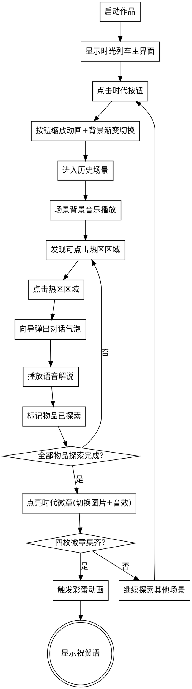

# 需求整理草稿

**整理日期：** 2026-04-09
**需求来源：** 原需求文档 + 交互补充
**文档状态：** 草稿/待确认
**评估等级：** B

---

## 一、项目概述

### 基本信息

| 项目 | 内容 |
|-----|------|
| 作品名称 | 《时光列车：驶向强国梦》 |
| 作品类型 | **多媒体电子绘本** - 基于Python的可交互爱国主义教育多媒体应用 |
| 主题方向 | 强国梦想、革命历史（红色爱国主题） |
| 作者 | 涂明洋（四年级13班） |
| 目标用户 | 小学生群体 |
| 作品定位 | 小学生编程比赛作品 - 交互式多媒体电子绘本应用 |
| 运行平台 | **小鹿AI编程APP** - 学校指定平台，作品上传后在该APP中运行 |

### 设计初衷

利用Python图形化编程技术，制作一个可以"触摸"历史的**多媒体电子绘本应用**，让同学们不再只是死记硬背历史年份，而是像翻阅一本会"说话"的绘本一样，亲身感受祖国跨越百年的伟大飞跃，增强民族自豪感和爱国情怀。

### 核心目标

- **教育目标**：以互动方式学习革命历史和强国历程
- **体验目标**：沉浸式时光穿越体验，主动探索式学习
- **比赛目标**：功能简洁但完成度高，界面活泼吸引评委

---

## 二、界面设计规范

### 整体布局

| 设计项 | 规范描述 |
|-------|---------|
| 布局类型 | **全屏沉浸布局** - 全屏场景画面，按钮和徽章浮动在画面上 |
| 界面风格 | **活泼卡通风格** - 适合小学生审美，充满童趣 |
| 美术风格 | **3D可爱绘本风格** - 3D渲染效果、鲜艳圆润、温馨可爱 |

### 色彩风格（场景适配）

| 时代场景 | 主色调 | 氛围描述 |
|---------|-------|---------|
| 红船启航 | 深红+暗金+暖黄 | 革命时期的庄严、历史厚重感 |
| 开国大典 | 明红+金黄+蓝天 | 庆祝氛围、胜利喜悦 |
| 改革春风 | 清新蓝绿+春意黄 | 春天希望、蓬勃发展 |
| 航天强国 | 深蓝星空+科技紫+星光银 | 科技感、太空探索 |

### 界面元素

| 元素 | 设计要求 |
|-----|---------|
| 时代按钮 | 浮动在画面下方，静态图片按钮，点击时有缩放动画效果（Pygame实现） |
| 徽章区域 | 右上角浮动显示，四个时代徽章横向排列，点亮时切换图片 |
| 向导角色 | 屏幕一角固定位置，静态透明PNG图片 |
| 对话气泡 | 弹出式气泡框，圆润活泼，弹出时有缩放动画效果 |
| 热区边框 | 开发阶段显示可拖动的边框、标签、位置，方便调整热区坐标 |

---

## 三、角色与素材设计

### 红领巾小向导

| 设计项 | 规范描述 |
|-------|---------|
| 角色形象 | **少先队员卡通形象** - 可爱活泼的卡通化少先队员 |
| 角色特征 | 穿校服、戴红领巾、笑容亲切、动作活泼 |
| 生成方式 | **AI生成（MiniMax）** - 使用 minimax-multimodal-toolkit 生成3D可爱绘本风格形象 |
| 表情状态 | 至少3种状态：默认站立、讲解时指向、庆祝时欢呼 |

### 场景素材

| 场景 | 核心视觉元素 | 素材生成方式 |
|-----|-------------|-------------|
| 红船启航 | 南湖、红船、革命者群像、旧时代建筑 | minimax-multimodal-toolkit |
| 开国大典 | 天安门城楼、五星红旗、群众庆祝场面 | minimax-multimodal-toolkit |
| 改革春风 | 东方明珠塔、现代城市、发展景象 | minimax-multimodal-toolkit |
| 航天强国 | 神舟飞船、太空站、星辰背景 | minimax-multimodal-toolkit |

> **素材生成统一方案**：所有背景图片、透明PNG素材、图标素材均使用 `minimax-multimodal-toolkit` 技能生成，详见"素材AI提示词设计"章节。

### 时代徽章

| 徽章名称 | 图标设计 | 获取条件 |
|---------|---------|---------|
| 觉醒徽章 | 红船造型+光芒 | 完成红船启航场景探索 |
| 建国徽章 | 五星红旗造型 | 完成开国大典场景探索 |
| 腾飞徽章 | 东方明珠塔造型 | 完成改革春风场景探索 |
| 航天徽章 | 神舟飞船造型 | 完成航天强国场景探索 |

---

## 四、功能需求详解

### 4.1 核心功能 (P0)

#### F01 - 时光列车场景导航系统

| 功能项 | 详细描述 |
|-------|---------|
| 功能概述 | 主界面呈现穿梭时间轴的"时光列车"，点击时代按钮切换场景 |
| 触发方式 | 点击屏幕下方四个时代按钮：【红船启航】【开国大典】【改革春风】【航天强国】 |
| 切换效果 | **简化方案** - 使用渐变过渡切换背景图片，列车图片固定显示在主界面作为装饰元素 |
| 视觉反馈 | 按钮点击时有缩放动画效果（pygame transform.scale），背景平滑渐变切换 |
| 技术实现 | Python + pygame，背景渐变过渡 + 按钮缩放动画 |

> **设计简化说明**：原方案的"列车移动+轮子转动+车窗闪烁"动效实现复杂度高，改为静态列车装饰图 + 按钮点击缩放 + 背景渐变过渡，降低实现难度。

#### F02 - 红领巾向导视听解说系统

| 功能项 | 详细描述 |
|-------|---------|
| 功能概述 | 每个场景设"红领巾小向导"，点击互动物品触发解说 |
| 互动物品 | 每个场景设置 **3-4个** 可点击核心物品区域 |
| 物品提示 | **透明热区方案** - 使用透明矩形区域作为可点击热区，开发阶段显示边框和标签方便调整位置，发布时隐藏边框 |
| 热区设计 | 热区覆盖场景中关键物品的位置，用户点击热区触发交互 |
| 解说触发 | 点击热区后触发两部分动作： |
| | 1. 角色弹出对话气泡显示核心文字信息 |
| | 2. 同步播放语音解说录音 |
| 语音时长 | **详细解说** - 每时代约1-2分钟解说内容 |
| 配音风格 | AI生成童声（minimax TTS），少先队员口吻，同龄人视角 |
| 对话气泡 | 弹出动画（Pygame缩放效果） + 点击关闭或自动消失 |

> **设计简化说明**：原方案的"物品发光效果"需要动态绘制发光边框或生成发光素材，实现复杂。改为透明热区方案，仅需定义矩形区域坐标，开发时显示调试边框，发布时隐藏，大幅降低实现难度。

#### F03 - 强国之路徽章收集机制

| 功能项 | 详细描述 |
|-------|---------|
| 功能概述 | 完成场景探索后点亮对应时代徽章，增加互动趣味性 |
| 徽章位置 | 右上角浮动显示区域，四个徽章横向排列 |
| 初始状态 | 四枚徽章初始为灰色/暗淡状态图片 |
| 点亮条件 | 观看完一个时代的所有物品介绍（全部点击触发） |
| 点亮效果 | **简化方案** - 切换为明亮状态图片 + 播放点亮音效 |
| 进度追踪 | 使用变量记录已探索物品数量，达到阈值切换徽章图片 |

> **设计简化说明**：原方案的"徽章发光动画"需要动态绘制发光效果，改为简单的图片切换 + 音效，用Pygame实现缩放动画即可。

### 4.2 重要功能 (P1)

#### F04 - 结尾彩蛋动画

| 功能项 | 详细描述 |
|-------|---------|
| 触发条件 | 集齐四枚"时代徽章"后自动触发 |
| 视觉效果 | 天安门广场上空升起绚丽烟花，和平鸽展翅飞过 |
| 音频效果 | 播放《我和我的祖国》高潮部分（或类似爱国歌曲） |
| 情感设计 | 强烈视觉与听觉震撼，将爱国情感推向高潮 |
| 结束提示 | 彩蛋结束后显示"恭喜完成强国之旅"祝贺语 |

#### F05 - 时代特色背景音乐

| 功能项 | 详细描述 |
|-------|---------|
| 功能概述 | 每个时代场景搭配符合时代氛围的背景音乐 |
| 音乐安排 | 四个时代各一首特色背景音乐，循环播放 |
| 音量控制 | 背景音乐音量适中，不干扰语音解说播放 |
| 版权考虑 | 使用免费可商用音乐或自制音乐 |

### 4.3 可选功能 (P2)

#### F06 - 操作引导提示（待确认）

| 功能项 | 详细描述 |
|-------|---------|
| 功能概述 | 首次进入时显示简短操作引导 |
| 显示方式 | 向导角色弹出引导气泡："点击场景中的物品，开始探索吧！" |
| 触发条件 | 仅首次进入作品时显示一次 |
| 技术实现 | 使用全局变量记录是否首次访问 |

> **说明**：由于采用透明热区方案，可考虑首次进入时短暂显示热区边框作为提示，或使用向导引导气泡。

---

## 五、交互流程设计

### 主交互流程



### 各场景互动物品规划

#### 红船启航场景
| 物品编号 | 物品名称 | 解说内容要点 |
|---------|---------|-------------|
| H01 | 南湖红船 | 介绍中共一大在红船上召开的历史背景 |
| H02 | 革命先驱群像 | 介绍参与一大的革命先驱代表人物 |
| H03 | 会议桌椅 | 介绍会议场景细节和历史意义 |
| H04 | 时代背景建筑 | 介绍1921年代的社会背景（待确认具体内容） |

#### 开国大典场景
| 物品编号 | 物品名称 | 解说内容要点 |
|---------|---------|-------------|
| K01 | 天安门城楼 | 介绍开国大典的历史意义和毛主席宣告 |
| K02 | 五星红旗 | 介绍国旗的设计含义和升起过程 |
| K03 | 群众庆祝场面 | 介绍人民群众参与庆祝的历史画面 |
| K04 | 礼炮/烟花 | 介绍开国大典的庆祝仪式（待确认） |

#### 改革春风场景
| 物品编号 | 物品名称 | 解说内容要点 |
|---------|---------|-------------|
| G01 | 东方明珠塔 | 介绍上海浦东开发开放的标志性成果 |
| G02 | 现代城市建筑 | 介绍改革开放带来的城市变迁 |
| G03 | 高速列车/公路 | 介绍交通基础设施发展（待确认） |
| G04 | 发展标语/口号 | 介绍改革开放的时代精神（待确认） |

#### 航天强国场景
| 物品编号 | 物品名称 | 解说内容要点 |
|---------|---------|-------------|
| Y01 | 神舟飞船 | 介绍中国载人航天工程的成就 |
| Y02 | 太空站/天宫 | 介绍中国空间站建设成果 |
| Y03 | 宇航员形象 | 介绍中国宇航员和太空探索精神 |
| Y04 | 星辰背景 | 介绍中国航天事业的未来展望（待确认） |

---

## 六、素材AI提示词设计

> **重要说明**：所有背景图片、透明PNG素材、图标素材均使用 `minimax-multimodal-toolkit` 技能生成，需编写精确的提示词以保持风格统一。

### 统一风格规范

所有素材生成的提示词需包含以下基础风格描述：

```
基础风格关键词：
- 3D可爱绘本风格（圆润造型、鲜艳色彩、温馨可爱）
- 明快活泼的色彩
- 儿童友好设计
- 平滑的3D渲染效果
- 柔和温暖的光照
- 中国爱国主题元素
- 童话般的梦幻氛围
```

### 6.1 场景背景图片提示词

### 屏幕尺寸配置

| 配置项 | 值 | 说明 |
|-------|---|------|
| 运行设备 | **iPhone手机** | 小鹿AI编程APP运行平台 |
| 屏幕方向 | **横屏** | 16:9比例 |
| 分辨率 | **1280 x 720** | 720p标准，推荐使用 |
| 宽高比 | 16:9 | 横屏设计 |

> **设计说明**：素材尺寸按1280x720设计，如需适配更高分辨率可等比例缩放。

#### 红船启航场景背景

| 素材名称 | 將寸建议 | 提示词（中文） |
|---------|---------|---------------|
| 红船启航全景背景 | 1280x720（iPhone横屏） | `3D可爱绘本风格，1921年南湖全景，一只中式的船屋木船威严的漂浮在宁静的水面上，革命年代的庄严氛围，温暖的琥珀色和深红色光线，柔和的夕阳余晖，远处有1920年代的复古建筑轮廓，中国爱国主题元素，圆润可爱的造型，鲜艳明快的色彩，平滑的3D渲染效果，童话般的梦幻画面，适合儿童欣赏` |

#### 开国大典场景背景

| 素材名称 | 將寸建议 | 提示词（中文） |
|---------|---------|---------------|
| 开国大典全景背景 | 1280x720（iPhone横屏） | `3D可爱绘本风格，1949年10月1日天安门广场全景，热烈的庆祝氛围，人群欢呼雀跃，鲜艳的红色和金黄色调，晴朗湛蓝的天空，五星红旗冉冉升起，中国爱国主题元素，圆润可爱的造型，平滑的3D渲染效果，温暖明快的色彩，童话般的梦幻画面，适合儿童欣赏` |

#### 改革春风场景背景

| 素材名称 | 將寸建议 | 提示词（中文） |
|---------|---------|---------------|
| 改革春风全景背景 | 1280x720（iPhone横屏） | `3D可爱绘本风格，上海浦东现代都市全景，东方明珠塔矗立在画面中央，春天的气息扑面而来，清新的绿色和蓝色调，现代化的城市建筑群，中国改革开放发展主题，圆润可爱的造型，平滑的3D渲染效果，温暖明快的色彩，充满希望的画面，童话般的梦幻氛围，适合儿童欣赏` |

#### 航天强国场景背景

| 素材名称 | 將寸建议 | 提示词（中文） |
|---------|---------|---------------|
| 航天强国全景背景 | 1280x720（iPhone横屏） | `3D可爱绘本风格，浩瀚星空全景，中国神舟飞船翱翔在深蓝色的星空中，深邃的紫色和银白色科技感色调，远处可见中国空间站，星辰闪烁的宇宙背景，中国航天探索主题，圆润可爱的造型，平滑的3D渲染效果，童话般的梦幻宇宙画面，温暖明快的色彩，适合儿童欣赏` |

#### 主界面背景

| 素材名称 | 將寸建议 | 提示词（中文） |
|---------|---------|---------------|
| 主界面背景 | 1280x720（iPhone横屏） | `3D可爱绘本风格，蒙太奇艺术效果，四个历史场景拼接成一幅画卷：左上角是南湖红船（红色小船在碧绿湖面），右上角是天安门城楼（红色金色建筑），左下角是东方明珠塔（现代都市剪影），右下角是飞船火箭（星空背景），四个场景用柔和的渐变过渡自然衔接，中央醒目放置可爱艺术标题"强国梦想 革命历史"，下方副标题"实验小学/四年级13班/涂明洋"，圆润可爱的造型，平滑的3D渲染效果，鲜艳明快的红金蓝色彩，童话般的梦幻画面，适合儿童欣赏` |

#### 结尾彩蛋背景

| 素材名称 | 將寸建议 | 提示词（中文） |
|---------|---------|---------------|
| 结尾彩蛋背景 | 1280x720（iPhone横屏） | `3D可爱绘本风格，天安门广场夜晚场景，绚丽的烟花绽放，红色、金色和蓝色的烟花在夜空中绽放，和平的白鸽展翅飞翔，热烈的庆祝氛围，中国爱国主题元素，圆润可爱的造型，平滑的3D渲染效果，鲜艳明快的色彩，童话般的梦幻画面，适合儿童欣赏` |

### 6.2 角色素材提示词

#### 红领巾小向导角色

| 素材名称 | 將寸建议 | 提示词（中文） |
|---------|---------|---------------|
| 向导-默认站立 | 400x530（透明PNG） | `3D可爱绘本风格，中国小学生卡通角色，穿着校服戴着红领巾（少先队员），亲切可爱的表情，站立姿势双手自然垂放，面带微笑，温暖明亮的色调，儿童友好设计，全身形象，透明PNG背景，圆润可爱的造型，平滑的3D渲染效果` |
| 向导-讲解指向 | 400x530（透明PNG） | `3D可爱绘本风格，中国小学生卡通角色，穿着校服戴着红领巾，兴奋的表情正在指向讲解，教学姿态手势友好，温暖明亮的色调，儿童友好设计，全身形象，透明PNG背景，圆润可爱的造型` |
| 向导-庆祝欢呼 | 400x530（透明PNG） | `3D可爱绘本风格，中国小学生卡通角色，穿着校服戴着红领巾，欢乐庆祝的表情，跳跃的姿势双臂高举，胜利欢呼的手势，温暖的节日氛围光线，儿童友好设计，全身形象，透明PNG背景，圆润可爱的造型` |

### 6.3 界面元素提示词

#### 时代按钮图标

| 按钮名称 | 將寸建议 | 提示词（中文） |
|---------|---------|---------------|
| 红船启航按钮 | 180x180（透明PNG） | `3D可爱绘本风格，图标按钮设计，红色小船剪影，琥珀色和暖红色调，圆形按钮形状，中国革命主题元素，儿童友好UI设计，透明PNG背景，圆润可爱的造型` |
| 开国大典按钮 | 180x180（透明PNG） | `3D可爱绘本风格，图标按钮设计，天安门城楼剪影，鲜艳的红色和金黄色调，圆形按钮形状，爱国主题元素，儿童友好UI设计，透明PNG背景，圆润可爱的造型` |
| 改革春风按钮 | 180x180（透明PNG） | `3D可爱绘本风格，图标按钮设计，东方明珠塔剪影，清新的蓝色和绿色调，圆形按钮形状，发展主题元素，儿童友好UI设计，透明PNG背景，圆润可爱的造型` |
| 航天强国按钮 | 180x180（透明PNG） | `3D可爱绘本风格，图标按钮设计，神舟飞船剪影，深邃的蓝色和银白色调，圆形按钮形状，太空探索主题元素，儿童友好UI设计，透明PNG背景，圆润可爱的造型` |

> **说明**：按钮为静态图片，点击缩放动画由Pygame代码实现。

#### 时代徽章图标

| 徽章名称 | 將寸建议 | 提示词（中文） |
|---------|---------|---------------|
| 觉醒徽章（点亮状态） | 100x100（透明PNG） | `3D可爱绘本风格，徽章设计，红色小船图标配金色边框，明亮的琥珀色调，成就徽章样式，中国爱国主题元素，圆形形状，透明PNG背景，圆润可爱的造型` |
| 觉醒徽章（暗淡状态） | 100x100（透明PNG） | `3D可爱绘本风格，徽章设计，红色小船图标用灰暗色调，暗淡的未激活状态，成就徽章样式，圆形形状，透明PNG背景，圆润可爱的造型` |
| 建国徽章（点亮状态） | 100x100（透明PNG） | `3D可爱绘本风格，徽章设计，五星红旗图标，鲜艳的红色和金黄色调，成就徽章样式，爱国主题元素，圆形形状，透明PNG背景，圆润可爱的造型` |
| 建国徽章（暗淡状态） | 100x100（透明PNG） | `3D可爱绘本风格，徽章设计，五星红旗图标用灰暗色调，暗淡的未激活状态，成就徽章样式，圆形形状，透明PNG背景，圆润可爱的造型` |
| 腾飞徽章（点亮状态） | 100x100（透明PNG） | `3D可爱绘本风格，徽章设计，东方明珠塔图标，清新的蓝色和绿色调，成就徽章样式，圆形形状，透明PNG背景，圆润可爱的造型` |
| 腾飞徽章（暗淡状态） | 100x100（透明PNG） | `3D可爱绘本风格，徽章设计，塔形图标用灰暗色调，暗淡的未激活状态，成就徽章样式，圆形形状，透明PNG背景，圆润可爱的造型` |
| 航天徽章（点亮状态） | 100x100（透明PNG） | `3D可爱绘本风格，徽章设计，神舟飞船图标，深邃的蓝色和银白色调，成就徽章样式，圆形形状，透明PNG背景，圆润可爱的造型` |
| 航天徽章（暗淡状态） | 100x100（透明PNG） | `3D可爱绘本风格，徽章设计，飞船图标用灰暗色调，暗淡的未激活状态，成就徽章样式，圆形形状，透明PNG背景，圆润可爱的造型` |

> **说明**：徽章为静态图片，点亮时切换图片并配合缩放动画+音效。

### 6.4 界面与装饰素材提示词

#### 主界面装饰素材

| 素材名称 | 將寸建议 | 提示词（中文） |
|---------|---------|---------------|
| 时光列车装饰图（主界面） | 800x280（透明PNG） | `3D可爱绘本风格，可爱的列车设计，中国爱国主题元素配色，鲜艳的红色和金黄色车身，现代卡通列车造型，儿童友好设计，侧面视角，透明PNG背景，圆润可爱的造型，平滑的3D渲染效果` |

> **设计简化说明**：列车作为静态装饰元素显示在主界面，无需动画帧序列。按钮点击动画由Pygame代码实现缩放效果。

#### 结尾彩蛋素材

| 素材名称 | 將寸建议 | 提示词（中文） |
|---------|---------|---------------|
| 天安门烟花场景（结尾背景） | 1920x1080 | `3D可爱绘本风格，天安门广场夜晚场景，绚丽的烟花绽放，红色、金色和蓝色的烟花在夜空中绽放，和平的白鸽展翅飞翔，热烈的庆祝氛围，中国爱国主题元素，儿童友好插画，鲜艳明快的色彩，圆润可爱的造型` |
| 祝贺语文字装饰 | 1000x160（透明PNG） | `3D可爱绘本风格，庆祝文字装饰设计，"恭喜完成强国之旅"中文文字配金色光晕效果，节日烟花背景点缀，爱国主题元素，儿童友好设计，透明PNG背景，圆润可爱的造型` |

> **结尾彩蛋简化方案**：使用静态烟花背景图片 + 祝贺语PNG叠加，配合音乐播放。无需复杂的烟花动画。

### 6.5 提示词使用注意事项

| 注意点 | 说明 |
|-------|------|
| **风格统一** | 所有提示词必须包含 `3D可爱绘本风格` 和 `圆润可爱的造型` |
| **透明PNG** | 角色、图标、按钮、装饰类素材必须包含 `透明PNG背景` |
| **色彩呼应** | 各时代场景提示词需使用对应的色彩关键词（红船用琥珀色/暖红色，开国用鲜艳红色/金黄色等） |
| **爱国主题** | 关键场景素材需包含 `中国爱国主题元素` 或相关主题关键词 |
| **尺寸适配** | 將寸需适配小鹿AI编程APP的实际显示尺寸（待确认具体尺寸） |
| **生成工具** | 使用 minimax-multimodal-toolkit 技能的 image generation 功能 |
| **简化素材** | 背景类素材为静态图片，无需动画帧序列；装饰类素材为静态透明PNG |

---

## 七、音频素材生成方案

> **重要说明**：所有语音、视频、音乐、TTS素材均使用 `minimax-multimodal-toolkit` 技能生成。

### 7.1 语音解说素材

#### 解说内容脚本（待编写）

| 场景 | 物品 | 解说时长 | 解说内容要点 | 生成方式 |
|-----|------|---------|-------------|---------|
| 红船启航 | 南湖红船 | 30-45秒 | 1921年中共一大召开的历史背景 | minimax TTS |
| 红船启航 | 革命先驱 | 30-45秒 | 参与一大的革命先驱代表人物介绍 | minimax TTS |
| 红船启航 | 会议桌椅 | 20-30秒 | 会议场景细节和历史意义 | minimax TTS |
| 开国大典 | 天安门城楼 | 30-45秒 | 1949年开国大典的历史意义 | minimax TTS |
| 开国大典 | 五星红旗 | 30-45秒 | 国旗设计含义和升起过程 | minimax TTS |
| 开国大典 | 群众庆祝 | 20-30秒 | 人民群众参与庆祝的历史画面 | minimax TTS |
| 改革春风 | 东方明珠塔 | 30-45秒 | 上海浦东开发开放的标志性成果 | minimax TTS |
| 改革春风 | 现代城市 | 30-45秒 | 改革开放带来的城市变迁 | minimax TTS |
| 航天强国 | 神舟飞船 | 30-45秒 | 中国载人航天工程的成就 | minimax TTS |
| 航天强国 | 太空站 | 30-45秒 | 中国空间站建设成果 | minimax TTS |
| 航天强国 | 宇航员 | 20-30秒 | 中国宇航员和太空探索精神 | minimax TTS |

#### TTS生成参数建议

| 参数项 | 建议值 | 说明 |
|-------|-------|------|
| 语音风格 | 童声/活泼女童声 | 符合少先队员口吻 |
| 语速 | 中等偏慢 | 适合小学生听众 |
| 语调 | 欢快亲切 | 同龄人视角讲解 |

### 7.2 背景音乐素材

| 场景 | 音乐风格 | Prompt提示词（中文） | 建议时长 | 生成方式 |
|-----|---------|-------------------|---------|---------|
| 主界面 | 欢快活泼、童趣温馨 | `欢快活泼的儿童绘本主题音乐，轻快节奏，温暖的钢琴和吉他旋律，积极向上的氛围，童话般的梦幻感觉，适合儿童游戏主界面，纯音乐无歌词` | 2-3分钟循环 | minimax music generation |
| 红船启航 | 革命年代、庄严激昂 | `革命历史主题背景音乐，庄严而激昂，低沉的弦乐与铜管乐器，怀旧的历史氛围，中国红色革命精神，沉稳大气的旋律，适合历史场景，纯音乐无歌词` | 2-3分钟循环 | minimax music generation |
| 开国大典 | 庆典风格、欢快热烈 | `盛大庆典主题背景音乐，欢快热烈，宏大的管弦乐编制，胜利的号角声，新中国成立的热烈氛围，振奋人心的旋律，适合开国大典场景，纯音乐无歌词` | 2-3分钟循环 | minimax music generation |
| 改革春风 | 春天气息、希望活力 | `改革开放主题背景音乐，充满希望与活力，明亮的弦乐与电子合成器结合，春天的气息扑面而来，时代进步的感觉，积极向上的旋律，适合改革发展场景，纯音乐无歌词` | 2-3分钟循环 | minimax music generation |
| 航天强国 | 科技未来感、太空主题 | `航天科技主题背景音乐，神秘的未来感，电子合成器与空灵音效，浩瀚星空的氛围，探索未知的神秘感，中国航天精神，适合航天强国场景，纯音乐无歌词` | 2-3分钟循环 | minimax music generation |
| 结尾彩蛋 | 《我和我的祖国》风格 | 用户自备 | 30-60秒 | 用户自行提供 |

### 7.3 音效素材

| 音效名称 | 用途 | 生成方式 |
|---------|------|---------|
| 点击音效 | 点击物品时播放 | minimax audio generation |
| 徽章点亮音效 | 徽章点亮时播放 | minimax audio generation |
| 列车行驶音效 | 场景切换时播放 | minimax audio generation |
| 烟花音效 | 结尾彩蛋时播放 | minimax audio generation |

---

## 八、技术实现方案

### 技术选型

| 技术项 | 选择 | 说明 |
|-------|------|------|
| 编程语言 | **Python** | 小鹿AI编程APP支持的编程语言 |
| 运行平台 | **小鹿AI编程APP** | 学校指定作品上传和运行平台 |
| **游戏框架** | **pygame** | 完整游戏框架，支持alpha渐变、灵活控制 |
| 图片处理 | Pillow | 图片加载、缩放、裁剪等处理 |
| 数值计算 | numpy | 动画缩放、渐变过渡等数学计算 |
| 美术素材 | **minimax-multimodal-toolkit** | 所有图片、透明PNG、图标均AI生成 |
| 音频素材 | **minimax-multimodal-toolkit** | 语音、音乐、TTS均AI生成 |
| 平台专用库 | zyb-image, zyb-tools, zyb-ai | 小鹿平台专用库（待确认具体功能） |

### 框架选择说明

> **选择pygame而非pgzero的原因**：
> 1. **渐变过渡需求**：需求要求"背景平滑渐变切换"，pygame的`Surface.set_alpha()`可精确控制透明度，pgzero不支持
> 2. **灵活可控**：pygame提供更底层的控制能力，适合多场景、状态管理
> 3. **学习价值**：pygame是通用游戏开发框架，学习价值更高

### 小鹿AI编程平台支持的第三方库

> 以下库已预装在APP中，可直接引入使用：

| 库名称 | 用途 | 本项目是否使用 |
|-------|------|--------------|
| **pygame** | 完整游戏框架 | ✓ **主要使用** |
| **Pillow** | 图片处理 | ✓ 图片加载处理 |
| **numpy** | 数值计算 | ✓ 动画计算 |
| pgzero | 简化游戏框架 | - 不使用 |
| matplotlib | 数据可视化图表 | - 不使用 |
| Flask | Web框架 | - 不使用 |
| requests | HTTP请求 | - 不使用 |
| ttkbootstrap | GUI组件 | - 不使用 |
| pymunk | 物理引擎 | - 不使用 |
| BeautifulSoup4 | HTML解析 | - 不使用 |
| TinyDB | 本地数据库 | - 不使用 |
| zyb-image | 小鹿图片处理 | ? 待确认功能 |
| zyb-tools | 小鹿工具库 | ? 待确认功能 |
| zyb-ai | 小鹿AI接口 | ? 待确认功能 |
| zyb-db | 小鹿数据库 | ? 待确认功能 |

### pygame项目结构

```
作品结构：
├── main.py                 # 主程序入口
├── config.py               # 常量定义、热区配置
├── state.py                # 全局状态管理
├── audio_manager.py        # 音频管理器（淡入淡出、静音控制）
├── assets/
│   ├── images/             # 图片素材
│   │   ├── backgrounds/    # 场景背景图片
│   │   │   ├── bg_main.png         # 主界面背景
│   │   │   ├── bg_redboat.png      # 红船启航场景背景
│   │   │   ├── bg_founding.png     # 开国大典场景背景
│   │   │   ├── bg_reform.png       # 改革春风场景背景
│   │   │   ├── bg_space.png        # 航天强国场景背景
│   │   │   └── bg_ending.png       # 结尾彩蛋背景
│   │   ├── characters/     # 角色图片
│   │   │   ├── guide_stand.png     # 向导-默认站立
│   │   │   ├── guide_point.png     # 向导-讲解指向
│   │   │   └── guide_celebrate.png # 向导-庆祝欢呼
│   │   ├── buttons/        # 导航按钮图片
│   │   │   ├── btn_redboat.png     # 红船启航按钮
│   │   │   ├── btn_founding.png    # 开国大典按钮
│   │   │   ├── btn_reform.png      # 改革春风按钮
│   │   │   └── btn_space.png       # 航天强国按钮
│   │   ├── badges/         # 徽章图片
│   │   │   ├── badge_awakening_dim.png    # 觉醒徽章-暗淡
│   │   │   ├── badge_awakening_lit.png    # 觉醒徽章-点亮
│   │   │   ├── badge_founding_dim.png     # 建国徽章-暗淡
│   │   │   ├── badge_founding_lit.png     # 建国徽章-点亮
│   │   │   ├── badge_takeoff_dim.png      # 腾飞徽章-暗淡
│   │   │   ├── badge_takeoff_lit.png      # 腾飞徽章-点亮
│   │   │   ├── badge_space_dim.png        # 航天徽章-暗淡
│   │   │   └── badge_space_lit.png        # 航天徽章-点亮
│   │   └── ui/             # UI装饰图片
│   │       └── train_decoration.png # 时光列车装饰图
│   └── audio/              # 音频素材
│       ├── bgm/            # 背景音乐
│       │   ├── bgm_main.mp3        # 主界面背景音乐
│       │   ├── bgm_redboat.mp3     # 红船启航背景音乐
│       │   ├── bgm_founding.mp3    # 开国大典背景音乐
│       │   ├── bgm_reform.mp3      # 改革春风背景音乐
│       │   ├── bgm_space.mp3       # 航天强国背景音乐
│       │   └── bgm_ending.mp3      # 结尾彩蛋音乐
│       ├── speech/         # 语音解说
│       │   ├── H01.mp3             # 南湖红船解说（红船场景）
│       │   ├── H02.mp3             # 革命先驱解说
│       │   ├── H03.mp3             # 会议桌椅解说
│       │   ├── H04.mp3             # 时代建筑解说
│       │   ├── K01.mp3             # 天安门城楼解说（开国场景）
│       │   ├── K02.mp3             # 五星红旗解说
│       │   ├── K03.mp3             # 广场群众解说
│       │   ├── K04.mp3             # 礼炮解说
│       │   ├── G01.mp3             # 东方明珠塔解说（改革场景）
│       │   ├── G02.mp3             # 现代城市解说
│       │   ├── G03.mp3             # 高铁解说
│       │   ├── G04.mp3             # 发展标语解说
│       │   ├── Y01.mp3             # 神舟飞船解说（航天场景）
│       │   ├── Y02.mp3             # 天宫空间站解说
│       │   ├── Y03.mp3             # 航天员解说
│       │   └── Y04.mp3             # 星辰大海解说
│       └── sfx/            # 音效（待补充）
│           ├── click.wav           # 点击音效
│           ├── badge_light.wav     # 徽章点亮音效
│           └── transition.wav      # 场景切换音效
├── scenes/                 # 场景模块
│   ├── __init__.py
│   ├── base_scene.py       # 场景基类
│   ├── main_scene.py       # 主界面场景
│   ├── redboat_scene.py    # 红船启航场景
│   ├── founding_scene.py   # 开国大典场景
│   ├── reform_scene.py     # 改革春风场景
│   ├── space_scene.py      # 航天强国场景
│   └── ending_scene.py     # 结尾彩蛋场景
├── ui/                     # UI组件模块
│   ├── __init__.py
│   ├── button.py           # 按钮组件（悬停放大效果）
│   ├── badge.py            # 徽章组件
│   ├── hotzone.py          # 热区组件
│   ├── dialogue_bubble.py  # 对话气泡组件（中文字体支持）
│   └── sound_toggle.py     # 静音开关组件
└── utils/                  # 工具模块
    ├── __init__.py
    ├── transition.py       # 场景渐变过渡
    └── animation.py        # 动画辅助函数
```

> **pgzero资源加载规则**：
> - 图片：放入`images/`目录，使用`Actor("image_name")`自动加载（无需扩展名）
> - 音效：放入`sounds/`目录，使用`sounds.sound_name`自动加载（无需扩展名）
> - 音乐：放入`music/`目录，使用`music.play("music_name")`自动加载

### 核心技术要点（pygame实现方案）

| 功能 | pygame实现方法 |
|-----|---------------|
| **背景素材** | `pygame.image.load()`加载，`screen.blit()`绘制 |
| **场景背景** | 静态Surface，配合透明热区作为可交互区域 |
| **热区交互** | `pygame.Rect`定义区域，`rect.collidepoint(pos)`检测点击 |
| **场景渐变切换** | `Surface.set_alpha()`控制透明度，实现平滑淡入淡出 |
| **按钮动画** | `pygame.transform.scale()`实现缩放动画 |
| **徽章效果** | Surface切换（暗淡→明亮）+ transform缩放 + 音效 |
| **对话气泡** | Sprite + transform缩放实现弹出动画 |
| **语音播放** | `pygame.mixer.music`（背景音乐）+ `pygame.mixer.Sound`（音效/语音） |
| **向导角色** | 透明PNG Surface，`convert_alpha()`加载 |

### pygame代码框架参考

```python
import pgzrun
from pygame import Rect

# ===== 常量定义 =====
WIDTH = 1280   # 屏幕宽度（iPhone横屏16:9）
HEIGHT = 720   # 屏幕高度

# ===== 状态变量 =====
current_scene = "main"  # 当前场景
explored_items = {}     # 已探索物品记录
badges_state = {"awakening": False, "founding": False, "takeoff": False, "space": False}

# ===== Actor定义 =====
train = Actor("train_decoration", (400, 500))  # 时光列车装饰
guide = Actor("guide_stand", (100, 400))       # 红领巾向导
bubble = Actor("dialogue_bubble", (200, 300))  # 对话气泡

# 时代按钮
btn_redboat = Actor("btn_redboat", (100, 550))
btn_founding = Actor("btn_founding", (250, 550))
btn_reform = Actor("btn_reform", (400, 550))
btn_space = Actor("btn_space", (550, 550))

# 徽章
badge_awakening = Actor("badge_awakening_dim", (720, 50))
badge_founding = Actor("badge_founding_dim", (760, 50))
badge_takeoff = Actor("badge_takeoff_dim", (800, 50))
badge_space = Actor("badge_space_dim", (840, 50))

# ===== 热区定义 =====
# 红船启航场景的热区
hotzones_redboat = [
    {"id": "H01", "name": "南湖红船", "rect": Rect(100, 100, 200, 150), "audio": "H01.mp3", "explored": False},
    {"id": "H02", "name": "革命先驱", "rect": Rect(300, 200, 150, 100), "audio": "H02.mp3", "explored": False},
    # ... 其他热区
]

# ===== 主函数 =====
def draw():
    screen.clear()
    # 根据当前场景绘制背景
    if current_scene == "main":
        screen.blit("bg_main", (0, 0))
        train.draw()
    elif current_scene == "redboat":
        screen.blit("bg_redboat", (0, 0))
        guide.draw()
        # 开发阶段绘制热区边框
        draw_hotzone_debug(hotzones_redboat)
    
    # 绘制按钮和徽章
    btn_redboat.draw()
    btn_founding.draw()
    btn_reform.draw()
    btn_space.draw()
    badge_awakening.draw()
    badge_founding.draw()
    badge_takeoff.draw()
    badge_space.draw()
    
    # 绘制对话气泡（如果显示）
    if bubble.visible:
        bubble.draw()

def update():
    # 更新动画状态
    pass

def on_mouse_down(pos):
    # 处理点击事件
    global current_scene
    
    # 检测按钮点击
    if btn_redboat.collidepoint(pos):
        current_scene = "redboat"
        sounds.click.play()
    
    # 检测热区点击
    if current_scene == "redboat":
        for zone in hotzones_redboat:
            if zone["rect"].collidepoint(pos) and not zone["explored"]:
                show_bubble(zone["name"], zone["audio"])
                zone["explored"] = True
                check_badges()

# ===== 辅助函数 =====
def draw_hotzone_debug(hotzones):
    """开发阶段绘制热区边框"""
    for zone in hotzones:
        screen.draw.rect(zone["rect"], (255, 0, 0))
        screen.draw.text(zone["name"], zone["rect"].center, color="red")

def show_bubble(text, audio_file):
    """显示对话气泡"""
    bubble.visible = True
    sounds.speech.play(audio_file)

def check_badges():
    """检查是否点亮徽章"""
    # 检查各场景是否全部探索完成
    pass

# ===== 启动游戏 =====
pgzrun.go()
```

### 热区设计规范（pygame版本）

```python
from pygame import Rect

# 热区数据结构
hotzone = {
    "id": "H01",              # 物品编号
    "name": "南湖红船",        # 物品名称（用于开发调试显示）
    "rect": Rect(x, y, w, h), # pgzero/pygame的Rect对象
    "audio": "audio/H01.mp3", # 对应语音解说文件
    "explored": False         # 是否已探索
}

# Rect坐标说明：
# Rect(100, 200, 150, 100) 表示：
# - 左上角坐标 (100, 200)
# - 宽度 150，高度 100
# - 右下角坐标自动计算为 (250, 300)
```

| 热区属性 | pgzero实现 | 说明 |
|---------|-----------|------|
| rect坐标 | `Rect(x, y, width, height)` | pygame.Rect类 |
| 碰撞检测 | `rect.collidepoint(pos)` | 检测点击是否在热区内 |
| 开发调试 | `screen.draw.rect()` | 绘制红色边框 |
| 发布隐藏 | 条件判断不绘制边框 | 仅保留点击检测 |

---

## 九、非功能需求

| 类型 | 要求 | 说明 |
|-----|------|------|
| **易用性** | 热区覆盖关键物品 | 热区位置覆盖场景中明显物品，方便小学生发现 |
| **易用性** | 简洁操作 | 仅需点击操作，无需复杂交互 |
| **易用性** | 开发调试辅助 | 开发阶段显示热区边框和标签，方便位置调整 |
| **性能** | 流畅切换 | 场景切换无明显卡顿 |
| **音频** | 音质清晰 | 语音解说录音清晰，无杂音 |
| **完成度** | 功能完整 | 核心功能全部可用，无半成品感 |
| **美观度** | 风格统一 | 3D可爱绘本风格贯穿全作品 |
| **实现难度** | 简化动效 | 采用静态素材+Pygame简单动画，降低实现复杂度 |

---

## 九、约束条件

| 约束类型 | 内容 |
|---------|------|
| 作品定位 | 小学生编程比赛作品，需符合比赛规则 |
| **运行平台** | **小鹿AI编程APP** - 作品必须能在该平台正常运行 |
| **作品性质** | **多媒体电子绘本** - 基于Python的可交互爱国主义教育应用 |
| 功能复杂度 | 功能简洁，避免过度复杂影响完成度 |
| 时间限制 | 比赛截止日期（待确认具体时间） |
| 技术限制 | Python实现，需适配小鹿AI编程APP的API和组件 |
| 素材生成 | 所有素材使用 minimax-multimodal-toolkit 生成，需编写精确提示词 |
| 风格统一 | AI生成素材需保持一致的3D可爱绘本风格 |
| 音频版权 | 使用 minimax 生成的音频无版权问题 |

---

## 十、待确认事项

- [ ] **pygame功能确认**：确认pygame在小鹿平台上的完整功能支持情况（特别是mixer音频模块）
- [ ] **zyb系列库功能**：确认 zyb-image、zyb-tools、zyb-ai、zyb-db 的具体功能和用途
- [ ] **解说内容脚本**：各场景物品的详细解说内容脚本待编写
- [ ] **热区坐标定位**：需要根据实际场景图片确定每个热区的Rect坐标
- [ ] **物品数量确认**：部分场景的物品名称和内容有待确认（标注待确认处）
- [ ] **比赛要求**：具体比赛的技术要求和作品提交格式
- [ ] **AI提示词优化**：根据 minimax-multimodal-toolkit 实际生成效果调整提示词（已调整为3D可爱绘本风格中文提示词）
- [ ] **素材尺寸确认**：适配小鹿AI编程APP实际显示尺寸的素材规格
- [ ] **操作引导**：是否需要首次进入时短暂显示热区边框作为提示
- [ ] **TTS语音风格**：确认 minimax TTS 支持的童声风格选项
- [ ] **音频格式兼容**：确认pygame.mixer支持的音频格式（mp3/ogg/wav）

---

## 十一、假设条件

- **假设1**：小鹿AI编程APP完整支持pygame框架及mixer音频模块 - 来源：用户提供的支持库列表
- **假设2**：minimax-multimodal-toolkit 能生成符合3D可爱绘本风格的高质量素材 - 来源：用户指定生成工具
- **假设3**：AI生成的语音解说能达到童声效果，符合少先队员口吻 - 来源：基于 minimax TTS 能力推断
- **假设4**：每场景3-4个物品能覆盖核心历史知识点 - 来源：基于小学生作品简化原则推断
- **假设5**：透明热区方案能让小学生发现可点击区域（热区覆盖明显物品位置） - 来源：用户建议简化方案
- **假设6**：pygame的transform.scale和Surface.set_alpha功能足以实现所需动画效果 - 来源：pygame完整功能支持
- **假设7**：静态素材+简单动画的组合能保证作品完成度 - 来源：用户强调完成度优先于复杂动效
- **假设8**：pygame虽然代码量稍多，但结构清晰，小学生可在指导下完成开发 - 来源：pygame是标准游戏开发框架

---

## 附录A：设计简化策略说明

> 本章节记录动效简化的决策依据，便于后续开发参考。

### 简化原则

| 原则 | 说明 |
|-----|------|
| **完成度优先** | 功能简洁但完整可用，优于复杂但不完整的方案 |
| **静态+简单动画** | 背景用静态图，小组件用Pygame简单动画 |
| **降低实现难度** | 避免复杂的帧动画、发光效果、多层叠加 |

### 简化对照表

| 原设计方案 | 简化后方案 | 简化原因 |
|-----------|-----------|---------|
| 列车移动+轮子转动+车窗闪烁 | 静态列车装饰图 + 按钮缩放动画 | 多帧动画实现复杂，素材拼接困难 |
| 物品发光高亮效果 | 透明热区（开发时显示边框） | 动态绘制发光边框或生成发光素材复杂 |
| 徽章点亮发光动画 | 图片切换 + 缩放动画 + 音效 | 动态发光效果实现复杂 |
| 烟花动画序列 | 静态烟花背景图 + 音乐 | 动态烟花需多帧或视频生成 |
| 对话气泡复杂动画 | 缩放弹出动画 | 简单缩放足以提供反馈感 |

### 素材分层策略

```
素材分层方案：

【背景层】- 静态图片或无缝循环视频
├── 主界面背景：静态图或循环视频（可选）
├── 历史场景背景：静态全景图
└── 结尾彩蛋背景：静态烟花图

【装饰层】- 静态透明PNG
├── 时光列车装饰图（主界面）
├── 红领巾向导角色（各场景固定位置）
└── 祝贺语文字装饰（结尾）

【交互层】- 热区 + 简单动画组件
├── 时代按钮：静态图片 + Pygame缩放动画
├── 徽章图标：图片切换（暗淡→明亮）+ 缩放动画
├── 对话气泡：弹出缩放动画
└── 透明热区：矩形区域（开发时显示边框）

【音频层】- AI生成音频
├── 背景音乐（循环播放）
├── 语音解说（点击触发）
└── 音效（按钮、徽章、点击反馈）
```

### pygame动画实现参考

```python
# ===== 按钮点击缩放动画 =====
# pgzero使用Actor的scale属性实现缩放
btn_clicked = None
btn_scale = 1.0
btn_scale_target = 1.0

def on_mouse_down(pos):
    global btn_clicked, btn_scale_target
    if btn_redboat.collidepoint(pos):
        btn_clicked = btn_redboat
        btn_scale_target = 1.2  # 放大目标
        sounds.click.play()

def update():
    global btn_scale
    # 缩放动画：平滑过渡到目标缩放值
    if btn_clicked:
        if btn_scale < btn_scale_target:
            btn_scale += 0.05  # 逐步放大
        elif btn_scale > 1.0:
            btn_scale -= 0.03  # 逐步缩小回原尺寸
            if btn_scale <= 1.0:
                btn_scale = 1.0
                btn_clicked = None
        btn_clicked.scale = btn_scale

# ===== 徽章点亮动画 =====
def light_badge(badge_actor, lit_image_name):
    """点亮徽章：切换图片 + 缩放动画 + 音效"""
    badge_actor.image = lit_image_name
    badge_actor.scale = 0.8
    # 在update中逐步缩放回1.0
    sounds.badge_light.play()

# ===== 对话气泡弹出动画 =====
bubble_visible = False
bubble_scale = 0.0

def show_bubble(text):
    global bubble_visible, bubble_scale
    bubble_visible = True
    bubble_scale = 0.1  # 从小开始

def update():
    global bubble_scale, bubble_visible
    if bubble_visible and bubble_scale < 1.0:
        bubble_scale += 0.1  # 快速放大
        if bubble_scale >= 1.0:
            bubble_scale = 1.0
    bubble.scale = bubble_scale

# ===== 场景切换渐变效果 =====
# pgzero可以通过调整screen.draw的alpha实现渐变
# 或使用多层背景叠加实现过渡效果
transition_alpha = 0

def draw():
    if transitioning:
        # 绘制旧背景（渐隐）
        screen.blit(old_bg, (0, 0))
        # 绘制新背景（渐显）- 使用Pillow处理alpha
        screen.blit(new_bg, (0, 0), alpha=transition_alpha)
    else:
        screen.blit(current_bg, (0, 0))
```

> **pgzero特点**：相比pygame，pgzero的Actor自带`scale`属性和`image`切换功能，动画实现更简洁。

---

## 附录B：本机开发预览方案

### 核心原理

小鹿AI编程APP内置的库（pygame、Pillow、numpy等）都是**标准Python第三方库**，这意味着：

> **在本地安装相同的Python环境和依赖库，就可以在本机运行和预览项目**

### 本机开发环境搭建

**步骤1：安装Python**

确保本地安装了Python（建议3.8+版本）

**步骤2：安装依赖库**

```bash
pip install pygame Pillow numpy
```

**步骤3：运行项目**

```bash
python main.py
```

### 开发流程

```
本机开发阶段：
┌─────────────┐    ┌─────────────┐    ┌─────────────┐
│ 编写代码     │ → │ 本机运行预览 │ → │ 调试修改     │
│ (VS Code等)  │    │ python main │    │             │
└─────────────┘    └─────────────┘    └─────────────┘
                          ↓ 开发完成
上传测试阶段：
┌─────────────┐    ┌─────────────┐    ┌─────────────┐
│ 打包项目文件 │ → │ 上传到小鹿APP│ → │ APP中运行测试│
│             │    │             │    │ (沙箱环境)   │
└─────────────┘    └─────────────┘    └─────────────┘
```

### 推荐的项目配置方式

```python
# config.py - 配置文件，方便适配不同环境

# ===== 屏幕尺寸 =====
SCREEN_WIDTH = 1280  # iPhone横屏16:9
SCREEN_HEIGHT = 720

# ===== 调试模式 =====
DEBUG_MODE = True  # 本机开发时设为True，上传前改为False

# ===== 路径配置 =====
IMAGES_DIR = "assets/images/"
AUDIO_DIR = "assets/audio/"
```

### 开发完成后的调整清单

| 序号 | 调整项 | 操作 |
|-----|-------|------|
| 1 | 关闭调试模式 | `DEBUG_MODE = False`，隐藏热区边框 |
| 2 | 检查资源路径 | 确保所有素材文件路径正确 |
| 3 | 测试音频播放 | 确认音频格式兼容（mp3/ogg/wav） |
| 4 | 打包项目 | 将所有文件打包上传到小鹿APP |

---

## 附录：原始需求文档摘要

> **作品名称**：《时光列车：驶向强国梦》
> **作品类型**：多媒体电子绘本 - 基于Python的可交互爱国主义教育应用
> **核心功能**：
> 1. 时光列车场景导航系统 - 四个时代按钮切换历史场景
> 2. 红领巾向导视听解说系统 - 点击物品触发对话和语音
> 3. 强国之路徽章收集机制 - 完成探索点亮时代徽章
> **创意亮点**：主动探索式学习、童音解说、情感递进的彩蛋设计
> **技术方案**：
> - Python + pygame（小鹿AI编程APP运行）
> - 素材生成：minimax-multimodal-toolkit（图片、语音、音乐）
> - 动效实现：静态素材 + pygame动画（渐变过渡、缩放动画）
> - 交互方案：透明热区替代发光效果，开发时显示调试边框
> - 美术风格：3D可爱绘本风格（圆润造型、鲜艳色彩、温馨可爱）